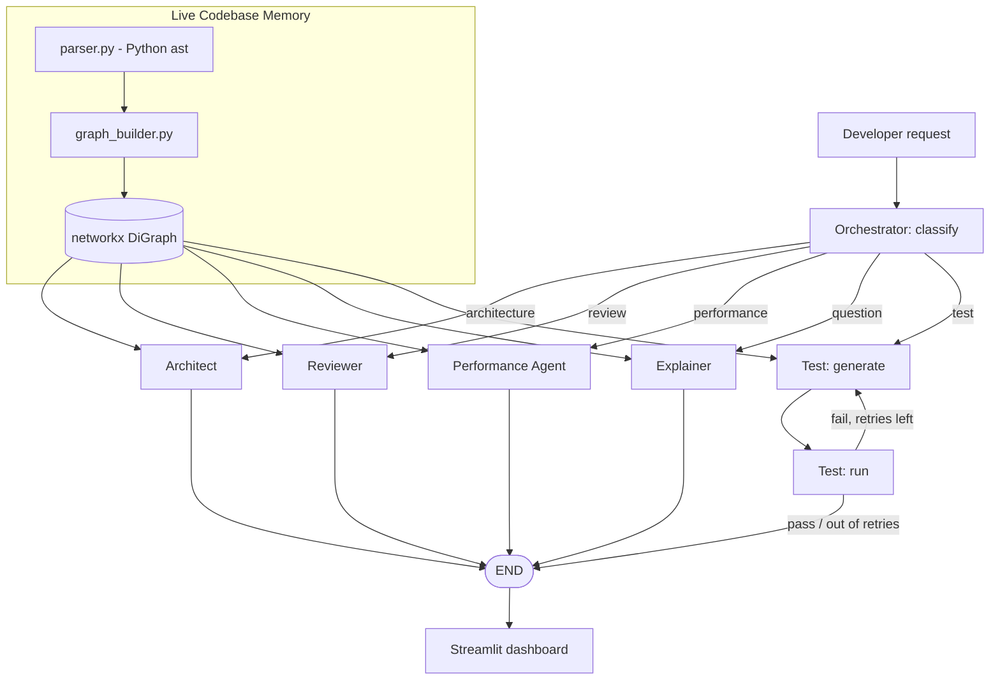

# Argus -- Living Engineering Co-Pilot

An AI assistant for engineers that goes beyond code completion: it builds
a live, structural graph of a codebase and uses it to draw architecture
diagrams that don't go stale, review code with real caller/callee
context, generate and repair unit tests, and flag likely performance
regressions before they ship -- all backed by a small set of real,
recent research papers rather than "we asked an LLM to do it."

**Nutanix Hackathon -- IIT Guwahati**
Project area: AI Assistant for Engineers
Team: AC/DC -- Krishang Vyas, Bhavya Khandelwal, Priyanshu Bhardwaj

---

## Table of contents

1. [The problem](#1-the-problem)
2. [The idea](#2-the-idea)
3. [Architecture](#3-architecture)
4. [How it actually works, module by module](#4-how-it-actually-works-module-by-module)
5. [Research this is grounded in](#5-research-this-is-grounded-in)
6. [Repo structure](#6-repo-structure)
7. [Setup and running it](#7-setup-and-running-it)
8. [Testing](#8-testing)
9. [Scope: MVP vs. roadmap](#9-scope-mvp-vs-roadmap)
10. [Evaluation-criteria alignment](#10-evaluation-criteria-alignment)
11. [Known limitations](#11-known-limitations)

---

## 1. The problem

Tools like Copilot/Cursor are excellent at *writing the next line*. They
are much weaker at what senior engineers actually spend time on:
understanding an unfamiliar part of a codebase, reviewing a change with
full knowledge of who else depends on it, writing tests that reflect real
usage rather than just a function signature, and noticing *before merge*
that a change is likely to regress performance.

Most of that is hard for a generic LLM because it has no persistent,
structural model of the codebase -- it re-reads and re-greps files from
scratch on every query.

## 2. The idea

Argus is built around one piece of shared infrastructure -- **Live
Codebase Memory**, a code graph (modules, functions, calls, imports)
parsed once and queried by everything else -- and five small, specialized
agents that all read from that same graph:

| Agent | What it does | File |
|---|---|---|
| **Architect** | Draws a structurally-accurate diagram from the graph; LLM only writes the module descriptions | `agents/architect_agent.py` |
| **Reviewer** | Reviews a function using its real callers/callees as context | `agents/reviewer_agent.py` |
| **Test** | Generates pytest tests, runs them for real, repairs failures in a loop | `agents/test_agent.py` |
| **Performance** | Scores a function's performance risk from static structural features | `agents/performance_agent.py` |
| **Explainer** | Answers plain-English questions about the codebase, grounded in the graph | `agents/explainer_agent.py` |

A **LangGraph** `StateGraph` orchestrates them (`orchestrator/graph.py`),
and a **Streamlit** dashboard (`dashboard/app.py`) puts all five behind
one screen, running against a small demo repo (`data/sample_repo/`) --
a tiny order-processing service with two bugs and one performance smell
deliberately left in so there's something real for Argus to find.

## 3. Architecture



Full diagrams: [`docs/diagrams/system-flow.mmd`](docs/diagrams/system-flow.mmd),
[`c4-context.mmd`](docs/diagrams/c4-context.mmd),
[`c4-container.mmd`](docs/diagrams/c4-container.mmd) (the container view is
the actual output the Architect Agent generates against `data/sample_repo`).

## 4. How it actually works, module by module

**`codebase_memory/parser.py`** walks every `.py` file with Python's
built-in `ast` module and extracts, per function: its qualified name,
arguments, docstring, source text, and the names it calls. Per module:
its imports.

**`codebase_memory/graph_builder.py`** turns that into a `networkx.DiGraph`:
one node per module and per function, `defines` edges from module to
function, `imports` edges between modules, and `calls` edges between
functions -- resolved by matching a called short name against known
function short names in the repo (good enough for one small repo; a real
multi-repo version would need import-aware scoping).

**`codebase_memory/graph_store.py`** wraps that graph with the queries
every agent actually needs: `callers_of`, `callees_of`, `context_for`
(bundles source + docstring + args + callers + callees for one function),
and `summary()`.

**`llm/client.py`** is a ~40-line wrapper around Groq's OpenAI-compatible
`/chat/completions` endpoint using `requests`, with a small retry loop.
It reads `GROQ_API_KEY` from the environment (via `.env` + `python-dotenv`)
-- the key is never written into any source file.

**Each agent** (`agents/*.py`) is a plain Python module: given a
`CodeGraph` and, where relevant, a target function name, it builds a
prompt from real structural context and calls `llm.client.chat`. The
Architect and Performance agents compute their core signal
(diagram structure; risk features) *without* the LLM, and only use it to
phrase natural-language explanations -- so the tool degrades gracefully
without an API key, rather than being purely LLM-shaped guesswork.

**`orchestrator/graph.py`** wires the agents together as a LangGraph
`StateGraph`: a `classify` node does keyword-based intent routing, a
conditional edge sends the request to the matching agent, and the Test
Agent's generate/run/repair loop is a real graph cycle
(`test_generate <-> test_run`) rather than a hand-rolled `while` loop.

**`dashboard/app.py`** is a Streamlit app with one tab per agent, all
calling the same functions above directly (no separate backend service --
deliberately simple for a demo).

## 5. Research this is grounded in

Full writeup with authors, venues, and exactly what was adapted vs.
substituted: [`docs/research-references.md`](docs/research-references.md).
Short version:

- **Codebase-Memory** (Vogel et al., arXiv:2603.27277) -- the graph-substrate idea (we substitute `ast` for tree-sitter; see the doc for why).
- **Collaborative LLM Agents for C4** (Szczepanik & Chudziak, arXiv:2510.22787) -- the Architect Agent.
- **Context-Aware Code Review Automation** (Icoz & Biricik, Applied Sciences 16(4) 2026) -- the Reviewer Agent.
- **TestPilot** (Schafer et al., arXiv:2302.06527) -- the Test Agent's generate-run-repair loop.
- **Regression Language Models for Code** (Akhauri & Song, arXiv:2506.21718) -- the Performance Agent's roadmap.
- **LLM-Based Multi-Agent Systems for SE** (He, Treude & Lo, arXiv:2404.04834) -- the overall multi-agent shape, implemented concretely with LangGraph.

## 6. Repo structure

```
argus/
├── README.md
├── LICENSE
├── requirements.txt
├── .env.example
├── .gitignore
├── docs/
│   ├── research-references.md
│   ├── demo-script.md
│   └── diagrams/
├── codebase_memory/
│   ├── parser.py
│   ├── graph_builder.py
│   └── graph_store.py
├── llm/
│   └── client.py
├── agents/
│   ├── architect_agent.py
│   ├── reviewer_agent.py
│   ├── test_agent.py
│   ├── performance_agent.py
│   └── explainer_agent.py
├── orchestrator/
│   ├── state.py
│   └── graph.py
├── dashboard/
│   └── app.py
├── data/sample_repo/        — the demo target (inventory.py, orders.py, pricing.py, notifications.py, main.py)
├── tests/                   — pytest suite, 10 tests, all passing without needing an API key
└── scripts/
    ├── setup.sh
    └── seed_demo.sh
```

## 7. Setup and running it

```bash
./scripts/setup.sh              # creates .venv, installs requirements.txt, copies .env.example -> .env
# edit .env and set GROQ_API_KEY=your-key-here
./scripts/seed_demo.sh          # builds the graph once, dumps graph.json, sanity-prints node/edge counts
pytest tests/ -q                # runs without needing an API key -- all agent LLM calls are mocked
streamlit run dashboard/app.py  # the actual demo UI
```

## 8. Testing

```bash
pytest tests/ -q
```

**10 passed.** All agent LLM calls are mocked in the test suite, so it
runs without network access or an API key -- coverage includes:

- The graph builder correctly parsing all 5 sample-repo modules and
  resolving cross-module call edges (17 nodes, 28 edges).
- The Performance Agent correctly flagging `orders.has_duplicate_items`
  (a seeded O(n^2) nested loop) as medium risk, and correctly scoring
  simple functions as low risk.
- The Test Agent's generate -> run -> repair cycle, exercised with both a
  passing case and a forced-failure-then-repair case against a real
  `pytest` subprocess.
- The full LangGraph orchestrator end-to-end for all five intents,
  including the `test_generate <-> test_run` retry cycle.

The Architect Agent's deterministic diagram builder was checked by hand
against the sample repo's real import/call structure and matches exactly.
The Streamlit dashboard was smoke-tested and serves correctly with the
graph loaded.

## 9. Scope: MVP vs. roadmap

| Area | Built here | Roadmap |
|---|---|---|
| Codebase Memory | Python via `ast`, single repo | Multi-language via tree-sitter, incremental updates, real graph DB |
| Architect Agent | Structural diagram + LLM descriptions | Live file-watcher auto-regeneration, full 3-level C4 |
| Reviewer Agent | Graph-context review | Real RAG over PR history once one exists |
| Test Agent | Generate/run/repair loop, real pytest | Coverage-guided generation, multi-function batches |
| Performance Agent | Static heuristic (complexity, nesting, fan-out) | Trained text-to-text regression model on real CI history |
| Explainer Agent | Keyword-matched graph grounding | Embedding-based retrieval for fuzzier questions |
| Dashboard | One Streamlit screen, single repo | Multi-repo, auth, history, PR webhook trigger |

## 10. Known limitations

- Call resolution matches by short function name, so two functions with
  the same name in different modules can be conflated on a larger repo.
  Fine for `data/sample_repo`; would need import-aware resolution for
  anything bigger.
- The Performance Agent's risk score is a heuristic, not a trained model
  -- treat its label as a conversation-starter, not ground truth.
- The Reviewer and Explainer agents are as good as the LLM behind them;
  no evaluation harness scores their output quality in this repo (a
  seeded ground-truth benchmark would be the natural next step).
- Single-repo, single-process design -- no auth, no persistence beyond
  the one `graph.json` dump, no multi-user support.
